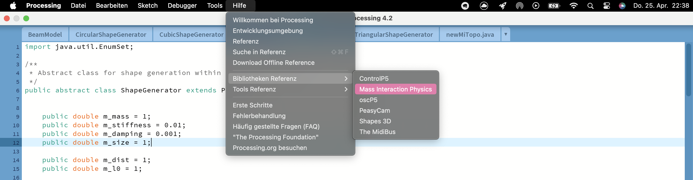
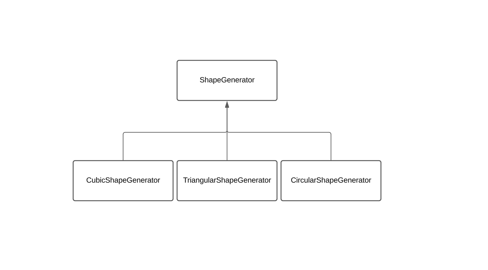

# Code Documentation 

## System Requirements
- Processing IDE
- ImFusion
- cmake 
- qtCreator
- miPhysics library for physics simulation
- PeasyCam library for 3D camera control
- oscP5 library for handling OSC messages
- netP5 library for networking capabilities

# Phymodel
For this please refer to the miPhysics Library documentation which you can find in Processing. 


---

# ShapeGenerator 



## Overview
The `ShapeGenerator` is an abstract class designed to facilitate shape generation within a physics engine. This class extends `PhyModel` and includes methods for setting up and manipulating physical properties, as well as adding nodes and connections based on geometric parameters.

## Properties
- **m_mass**: Default mass of nodes (default: 1.0).
- **m_stiffness**: Spring stiffness (default: 0.01).
- **m_damping**: Damping coefficient (default: 0.001).
- **m_size**: Size of the nodes (default: 1.0).
- **m_dist**: Default distance between nodes (default: 1.0).
- **m_l0**: Natural length of springs (default: 1.0).
- **m_neighbors**: Number of neighboring nodes each node should connect to (default: 2).
- **plane2D**: Determines if the shapes are generated in a 2D plane (boolean).
- **m_generated**: Indicates if the shape has been generated (boolean, initially `false`).

## Constructor
```public ShapeGenerator(String name, Medium m)```

Parameters:
name: Name of the shape generator.
m: Medium in which the shapes will be generated. 

## Methods
```init()```

Initializes the shape generation. If shapes have not been generated (m_generated is false), the program will terminate with an error message.

```generate()```

Abstract method that must be implemented by subclasses to define specific shape generation logic.

```setParams(double mass, double stiffness, double damping)```

Sets the mass, stiffness, and damping parameters.

-  Parameters:
    - mass: Mass of the nodes.
    - stiffness: Stiffness of the springs.
    - damping: Damping coefficient.


```setGeometry(double dist, double l0)```

Sets the geometric properties of the shape, including the distance between nodes and the natural length of the springs.

- Parameters:
    - dist: Distance between nodes.
    - l0: Natural length of the springs.


```addNodeAt(int x, int y, int z)```

Adds a node at specified coordinates.

- Parameters:
    - x: X-coordinate of the node.
    - y: Y-coordinate of the node.
    - z: Z-coordinate of the node.


```addConnectionFor(int x1, int y1, int z1, int x2, int y2, int z2)```

Creates a connection between two nodes defined by their coordinates.

- Parameters:
    - x1, y1, z1: Coordinates of the first node.
    - x2, y2, z2: Coordinates of the second node.


```processPoints(int numClosest)```

Processes all nodes to find and connect each node to its closest neighbors based on a specified number of closest points.

- Parameters:
    - numClosest: Number of closest points to connect to each node.

```findClosestPoints(Mass currentPoint, ArrayList of Mass points, int numClosest)```

Finds and returns a list of the closest points to a given point, based on the specified number of closest neighbors.

- Parameters:
    - currentPoint: The point from which distances are measured.
    - points: List of all points.
    - numClosest: Number of closest points to find.

```euclideanDistance(Mass p1, Mass p2)```

Calculates and returns the Euclidean distance between two points.

- Parameters:
    - p1: First point.
    - p2: Second point.


## Private Helper Methods
```getNodeName(int x, int y, int z)``` 

Generates a standardized node name based on its coordinates.

- Parameters:
    - x: X-coordinate of the node.
    - y: Y-coordinate of the node.
    - z: Z-coordinate of the node.
- Returns: A string representing the node name, formatted as m_x_y_z.

## Example Usage 

```
CircularShapeGenerator myShapeGen = new CircularShapeGenerator("MyShape", someMedium);
myShapeGen.setParams(2.0, 0.05, 0.002);
myShapeGen.setGeometry(1.5, 1.0);
myShapeGen.generate();
```

